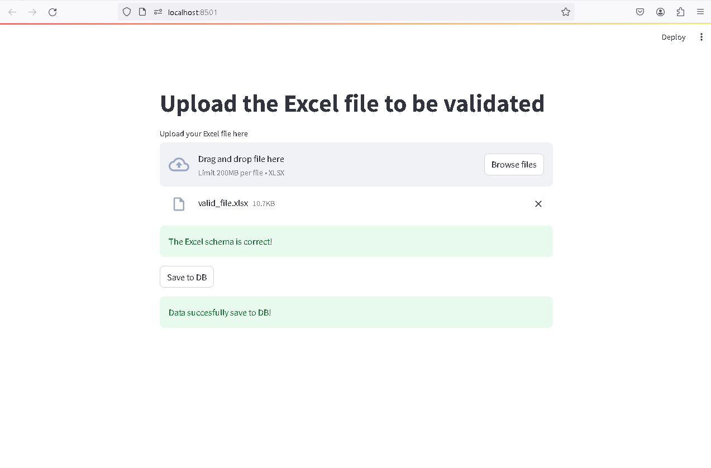

# Validate Excel with Pydantic then save data to DB

A small project to validate data from an Excel file using Pydantic, then the data is saved in PostgreSQL database.

**Main libs/tech:**   
    - Front-end: Streamlit ([Here](#image))   
    - Data validation: Pydantic   
    - Observability: module logging (Python) and Sentry    
    - Documentation: Mkdocs ([Here](https://robinsonlovatto.github.io/validate_excel_save_to_db/))   
    - Tests: Pytest   
    - Task automation: Taskipy   

### Installation

1. Clone the repository:
```bash
git clone https://github.com/robinsonlovatto/validate_excel_save_to_db.git
cd validate_excel_save_to_db
```
2. Configure the right version of Python with `pyenv`:
```bash
pyenv install 3.11.5
pyenv local 3.11.5
```
3. Install the project dependencies:
```bash
#create the virtual env
python -m venv .venv

# activate the virtual env (windows based)
source .venv/Scripts/Activate

# install the dependencies
pip install -r requirements.txt  
```

4. Create the PostgreSQL database (mine was created on render.com) and configure the .env file (as in .env-example).
```sql
/* Create the table Sales */
CREATE TABLE sales(
    id SERIAL PRIMARY KEY,
    email VARCHAR(255) NOT NULL,
    date TIMESTAMP NOT NULL,
    price NUMERIC(10,2) NOT NULL CHECK (price >= 0),
    quantity INTEGER NOT NULL CHECK (quantity >= 0),
    product VARCHAR(255) NOT NULL,
    category VARCHAR(50) NOT NULL
);
```

5. Create the Sentry account and configure the .env file.

6. Commands to run the app and the tests:
```bash
# run the streamlit app
task run

# run the automated tests
task tests
```    

#### Image
<figure>
    
    <figcaption>Front-end made with Streamlit.</figcaption>
</figure>
